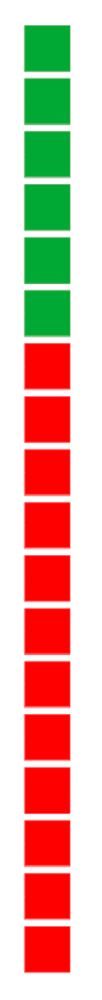
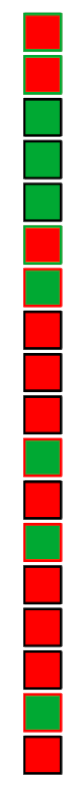
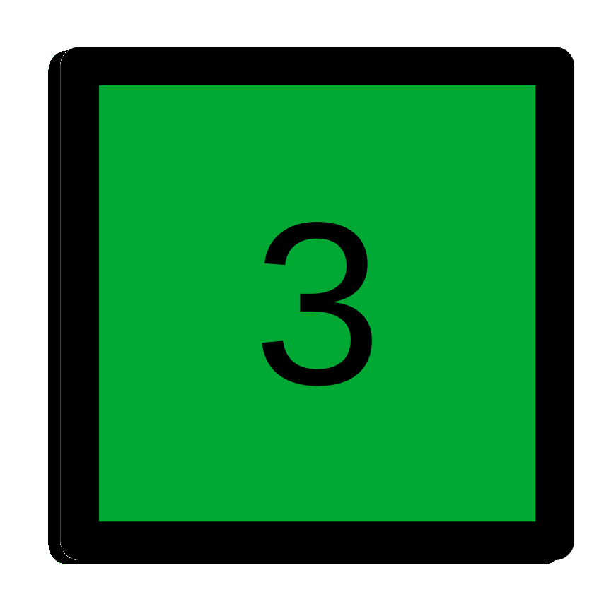
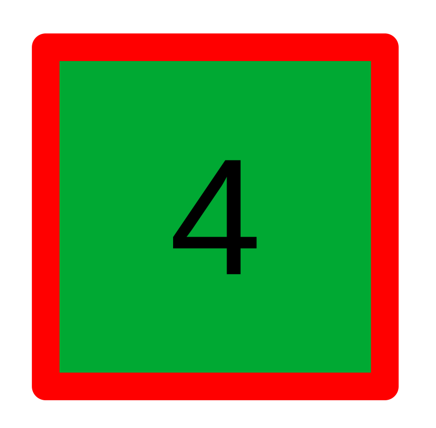
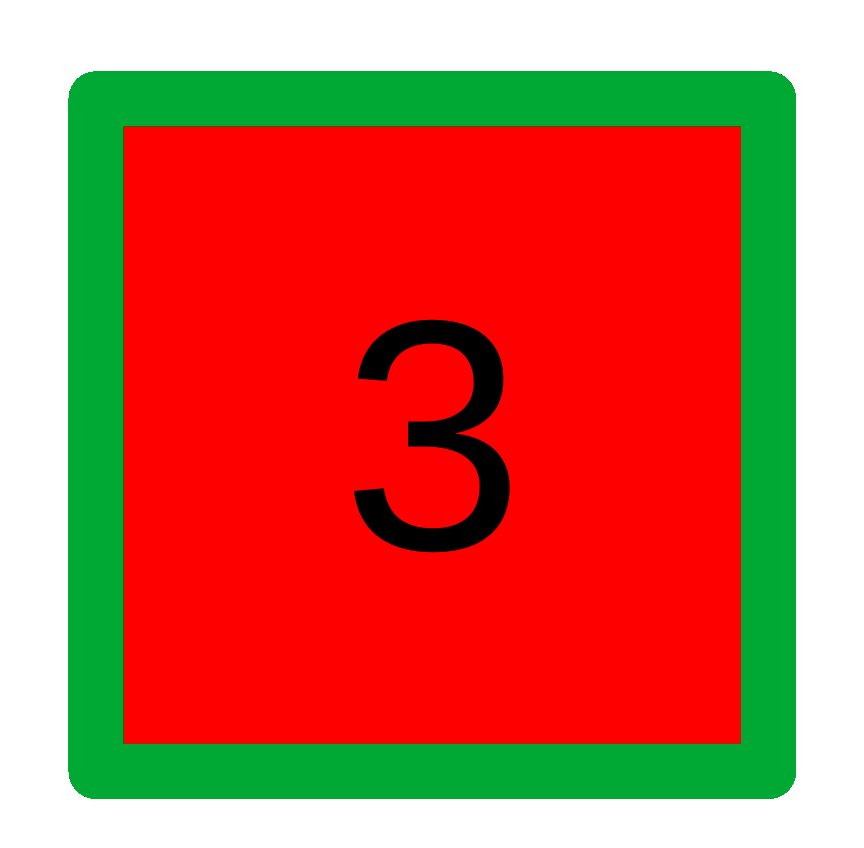

Confusion matrices can at times be confusing and so can all the metrics that go along with them. Here we'll try to break down intuitively what their purpose is and what each of the metrics mean.

# Why do we need confusion matrices?

Confusion matrices are a useful way to summarise model perfromance when dealing with classification tasks. Not only do they apply to the binary classifcation task but can also be used when dealing with more than two classes.

You might be thinking we have a simple way to evaluate model performance already - lets see how accurate our predictions are? What proportion of our predicted labels match the actual labels? Lets look at an example to see why accuracy is not a great metric.

Say we have a dataset made up of 100 cricket players from UK cricket clubs. Our target variable is a boolean value *opening_batsman*  which indicates if a player is an opener (1) or isn't (0). Our target is only 5% of our data (meaning 5 of the players in our data are opening bastmen).

If we predict all players are *not* opening batsmen our accuracy would be 95% because just by predicting everything as our dominant class (not an opening batsman) we get 95% of labels correct. 95% sounds great but if we were hoping to identify new up and coming opening batsmen this would not work at all and our accuracy measure is giving the wrong impression. Here the class we actually care about getting right (even though its only 5% of all labels) are the opening batsman.

A confusion matrix allows us to dig deeper into our results and look at each target class to judge performance.

# What is a confusion matrix?

Lets look at a slightly smaller dataset below where only the target variable is shown in green for *opening_batsman* $=1$ and red for *opening_bastman* $=0$.

We've built a model that predicts the class for the below samples and this is given on the right. The colour of the predicted blocks shows the models predicted class and the outline of these predictions is either black when correct or the colour of the correct label when we misclassify.

    

     
Left: actual labels.

     
Right: predicted labels.

    

## Constructing the matrix
To construct a confusion matrix we have predictions as our rows and actual labels as our columns. In each set of labels we can have values of positive (1) and negative (0). This gives us a 4x4 matrix as shown below. If we count up the different coloured blocks and borders of our predictions we get the values shown.

|                   |           |           |           |                   |
|:-:                |:-:        |:-:        |:-:        |:-:                |
|                   |           | **Actual**           ||                   |
|                   |           |   **1**   |  **0**    | Total Predicted   |
|  **Predicted**    |  **1**    |   True positives (TP)   |  False positives (FP)       |  7                |
|                   |  **0**    |  False negatives (FN)     |   True negatives (TN)     | 11                |
|  Total Actual     |           | 6         | 12        | *18*              |

The terminology we use to label each block of the confusion matrix is either true or false (is our prediction correct/true or not/false) followed by what our prediction was (positive/1 or negative/0 prediction). 

## The diagonal
The digaonal of a confusion matrix tells us about the correct classifications our model made. Summing these and dividing by the total number of samples will give us the accuracy measure we discussed above. For this dataset we have $3+8=11$ out of 18 predictions that are correct giving us an accuracy of $11/18 = 57.9\%$.  

But we already mantioned that we care more about the performance of our model for predicting a label of 1.

## How good are we at predicting *opening_batsman*=1?

There are a few intuitive measures to consider when quantifying how well our model performs when looking at a specific class

1. How good are we at finding actual opening batsmen?
2. How often are our predictions of who is an opening batsmen correct?

For the first point we could think of this as trying to see how many actual opening_batsman = 1 labels we managed to catch. This we can get with the ratio between the number of correct predictions for opening_batsman = 1  (TP) and all the actual opening_batsman = 1 labels (TP+FN). This measure is called recall and gives ua an idea of well we can recall the ground truth of our underlying data. Recall has the below formula

$recall=\frac{TP}{TP+FN}$

For the second point we are tryinbg to understand how often our postive predictions are actually correct. For this we again need our correct opening_bastman = 1 (TP) as the numerator but for our denominator we now need all predictions where opening_bastman = 1 regardless of whether they were correct or not (TP+FP). This measure tells us how precise we are at predicting and is called precision. The formula is given be

$precision = \frac{TP}{TP+FP}$
