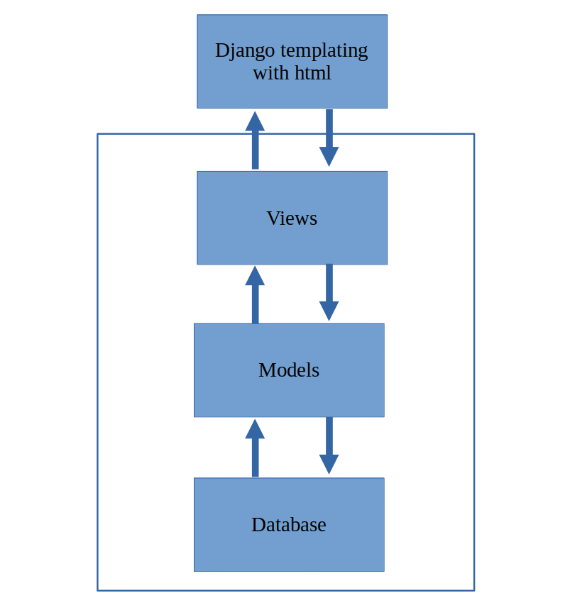
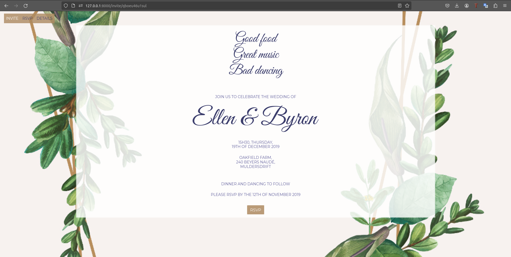
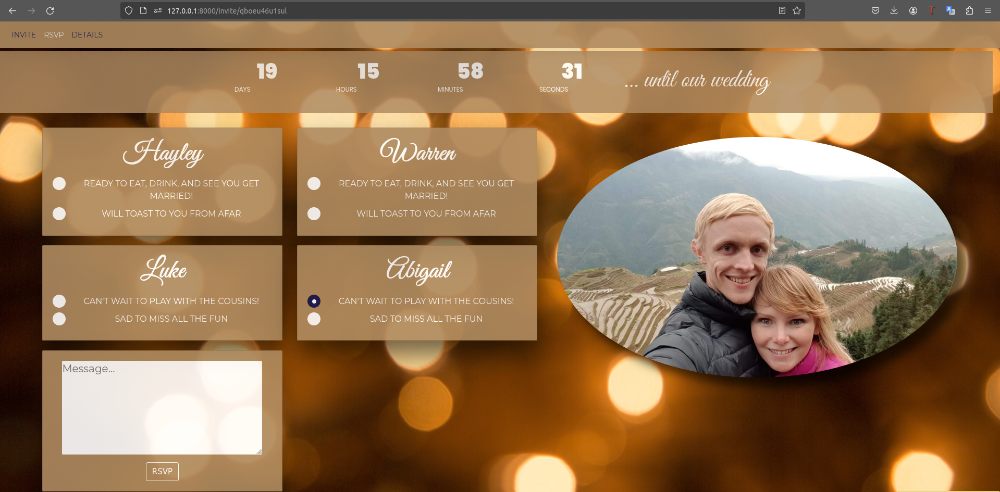
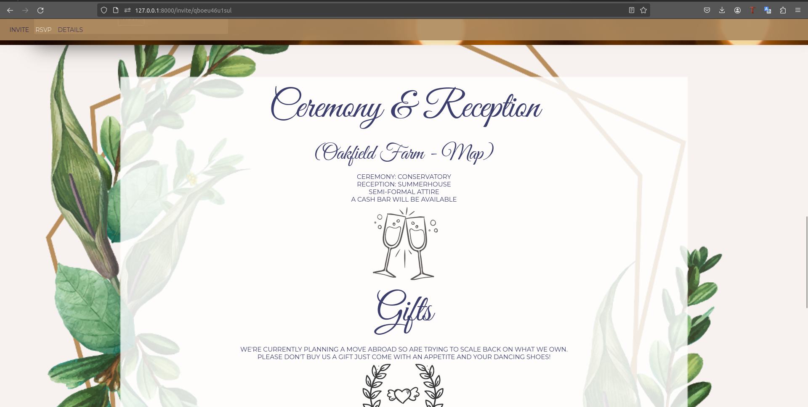
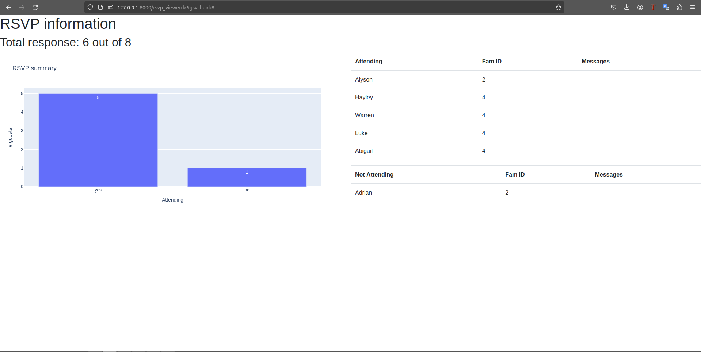
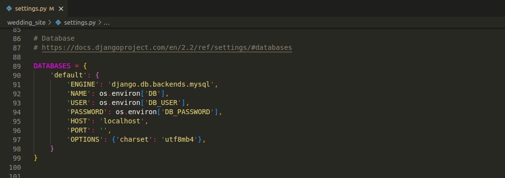

In this post I'll take you through the web app I built using Django to handle my wedding invites and RSVP tracking. It was great fun to build! You can check out the code on [github](https://github.com/ellendmk/django-wedding-site).

# What I was aiming for

I love automating admin away and what better way to keep track of all wedding invites and RSVPs than with a custom web app? (Probably took me more time to set this up than it would have to send emails and set up a spreadsheet but this was definitely more fun!)

So first lets define some functionality I wanted this app to have

- Be web and mobile compatible
- Contain relevant ceremony info
- Define clearly who was invited from each family (children of close family and friends were invited but other children not)
- Capture RSVP info
- Store info from guests in a db which could be exported 
- Track who had opened the link and who had responded
- Allow for custom messaging to be displayed on the invite when the link was opened by certain people

Django was a natural choice as python is one of my favorite languages and Django provides a great framework for structuring web apps and allowing modular components that are easy to work with.

Let's start by understanding more about Django.

# Overview of Django framework

Django is a high-level Python web framework that enables rapid development of secure and maintainable web applications. It provides a comprehensive set of tools and libraries to handle common web development tasks, allowing developers to focus on writing application logic rather than reinventing the wheel. Originally developed by Django Software Foundation, Django has gained widespread popularity and is used by companies and developers worldwide.

At its core, Django follows the Model-View-Template (MVT) architectural pattern, which is similar to the more well-known Model-View-Controller (MVC) pattern. In Django's MVT pattern, the Model represents the data structures and business logic of the application, the View handles the presentation layer and user interface, and the Template defines the layout and structure of the HTML pages. This separation of concerns allows for easier code organization and maintenance.

Django also includes a built-in authentication system, form handling, URL routing, template engine, and admin interface, among many other features. Its robust security features, including protection against common web vulnerabilities like SQL injection, cross-site scripting (XSS), and cross-site request forgery (CSRF), make it suitable for developing secure web applications.



# Final product

This web app was hosted on an AWS EC2 instance using Nginx and gunicorn. The site isn't currently live so below are some screenshots to give you a sense of what it looked like in action.










Below I dive into a little more detail on the unique aspects of this project.

## Fixtures and Models

One of Django's key features is its powerful and flexible ORM (Object-Relational Mapping) system, which abstracts the database layer and allows developers to interact with databases using Python objects. This makes database operations straightforward and database-agnostic, supporting multiple database backends such as PostgreSQL, MySQL, SQLite, and Oracle.

In my project I used a MySql DB and had two models, `guests` and `families` in the `guest_handler` app. These models are pre-populated with fixtures containing all invited guests.


The `guests` model has the below fields

- name (`str`: name to appear in invite)
- child (`boolean`: are they a child or not?)
- family_id (`int`: to link to the families fixture so make sure `family_id` in both align and all members of a single family have the same value)
- email (`str`: email address used to mail out invites)
- responded (`boolean`: have they responded?)
- attending (`boolean`: are they attending?)
- fun (`boolean`: to filter certain messaging in invite)
- message (`str`: to store any message they want to send when sending their RSVP)

The `families` model has the below fields

- family_id (`int`: to link to the guests fixture - all members of a single family have the same value)
- url_suffix (`str`: specific randomly generated string used to identify which invite to display)
- child_allowed (`boolean`: are children allowed in this invite?)

Django automatically creates the necessary tables in MySQL that your models.py files define. All that is needed is that a user and password be set up with access to the specific database Django will interact with. These parameters get stored in the `settings.py` file of the main application as shown on lines 92 to 94 below.



In order to get Django to set up the necessary tables run (where guest_handler can be replaced by the app you want to create the necessary models for)

```
python manage.py makemigrations guest_handler
```

Then actually perform the migrations with

```
python manage.py migrate guest_handler
```

After this point we can now load the fixtures into the respective tables

```
python manage.py loaddata guest_manager/fixtures/families.json
python manage.py loaddata guest_manager/fixtures/guests.json
```

## URLS

Each guest was sent their unique invite link. This consisted of a base url followed by `invite/<unique string>`. This allowed us to tailor what each guest saw on their invite making it clear who was invited and whether children were invited.

Each invite string was unique to a family and this would allow us to pull the relevant invite message depending on who was part of the family. Depending on certain parameters for given guests/families, different messaging was displayed on the invite. Here's a summary of what each field affected

- `child` - children would see options of "Can't wait to play with the cousins!" or "Sad to miss all the fun" and adults (child=0) would have options of "Ready to eat, drink, and see you get married!" or "Will toast to you from afar" displayed.
- `fun` - certain messaging at the top of the invite was changed depending on this flag. This was either tame and traditional for older generations or hinting at a wild night for younger guests. A random message is selected each time the web page loads.
- `child_allowed` - this allowed us to include specific messaging for guests with children when their children were not invited.

In addition to this a unique url that we hardcoded was used to provide some aggregated info on how many people would be attending and who had responded. This unique url was the base url followed by `rsvp_viewerdx5gsvsbunb8`,

## Nginx and gunicorn