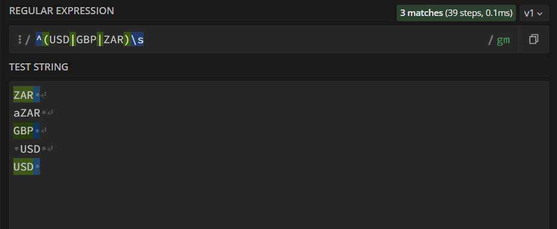

Regular expressions are a great way to define and check for complex patterns within strings. But often they can look cryptic and are tricky to write. In this post we'll look at an example related to currency to try break down some important principles that you can reuse for other regex tasks.


# Identifying a currency string

We're interested in identifying valid currency strings. For this example we define a valid string as follows

- Must start with the currency which is one of USD, GBP or ZAR
- A space must follow the currency
- The monetary value should follow this 
  - with comma separation 
  - if any decimal points occur exactly two numbers should follow with the first non-zero 
  - no leading zeroes on the left of the decimal point


The below examples should make the above constraints clear

Valid strings:
```
USD 27.32       # valid string
USD 27          # valid string
USD 109,627     # valid string
USD 72,109,627  # valid string
ZAR 100,027.32  # valid string
```

Invalid strings
```
AUD 100,027.32    # not valid string - AUD not accepted
GBP 03.32         # not valid string - leading zero
GBP 1227.32       # not valid string no comma separator for 1000
aZAR 50           # not valid string doesn't start with correct currency
USD 27.02         # not valid string - leading 0 after decimal
```

So lets break down the problem into 3 parts
1. Currency
2. Whole numbers
3. Decimals


And lets list some useful regex 

| Character | Type of syntax | What it does    |
|-----------|-----------|-----------------|
| ^         |Anchor| Must appear at start|
| (...)        | Logic | Used to capture different pattern groups|
| \|   | Logic    | Or between multiple valid patterns|
| +         |Quantifier| One or more times
| *         |Quantifier| Zero or more times
| {3}         |Quantifier| Exactly 3 times
| {1,3}         |Quantifier| Between 1 and 3 times
| \        |Other| Escape character
| .        |Other| Any character except line break
| \s        |White space| Space character

A useful resource when working with regex is [regex101.com](https://regex101.com/). It allows you to test and gives explanations on each part of your regular expression.

## 1. Currency

We know our string should start with one of USD, GBP or ZAR. The regex for this would be 

```
^(USD|GBP|ZAR)\s
```

Breaking this down,
- the `^` tells us this should occur at the start and 
- we want the patterns in our first group `(...)` to match, 
- which is one of three strings which we separate with an or `|`
- and should be followed by a space `\s`

You can test this at [regex101.com](https://regex101.com/). In he image below we can see the lines that begin with our currency strings are correct and those with preceding characters don't.




## 2. Whole numbers

```
(0{1}|[1-9]{1}[0-9]{2,3},[0-9]{3}?)
```

Lets break this down into a few pieces 
  a. `0{1}` 
  b. `|`
  c. `[1-9]{1}`
  d. `[0-9]{2,3}`
  e. `,`
  f. `[0-9]{3}?`
  
The first piece

```
0{1}
```

is looking for a single character `0`.

The second piece is saying the following
- or (`|`) 
- we could have 1 digit between 1 and 9 `[1-9]{1}` (this will ensure no leading zeroes in our whole numbers but we should still allow for zeroes after the first digit)
- followed by between 2 and 3 digits with values between 0 and 9 `[0-9]{2,3}` (this ensures we can have values of 10 or 100 appearing as valid)
- which should be followed by a comma `,`


## 3. Decimals

```
(.[1-9][0-9])?$
```